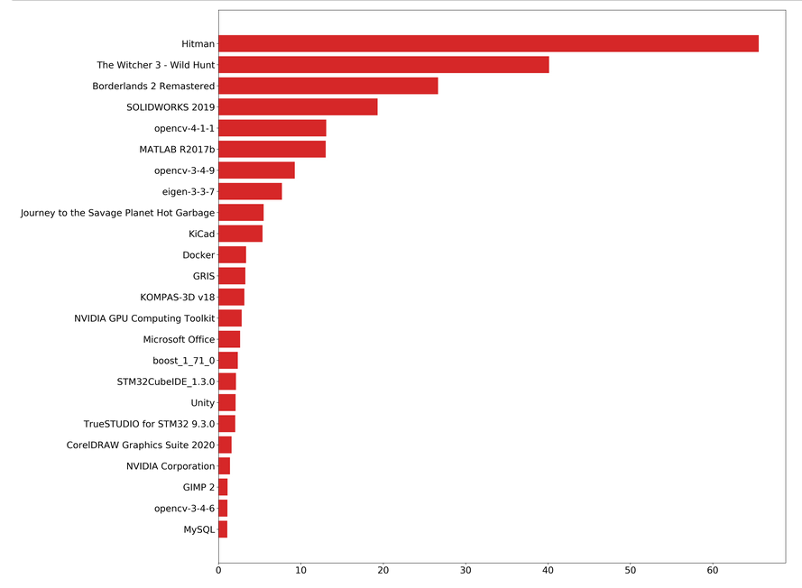
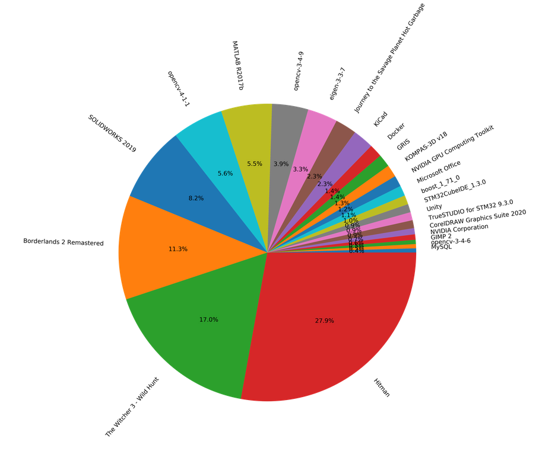

### Приложение для анализа занятого места на диске

Рекурсивный обход указанного каталога с помощью `os.walk()`, подсчёт размеров вложенных
файлов и каталогов. Кеширование данных в текстовом файле.

***

